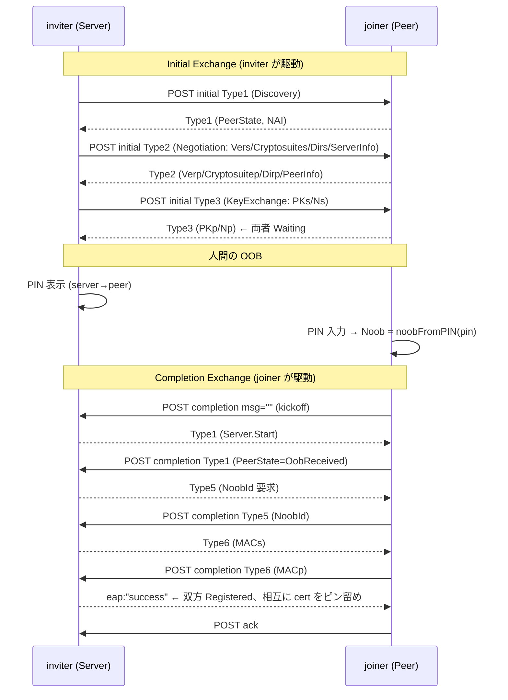

# クラスタ・ペアリング（EAP-NOOB / 実クラスタ参加）

*English: [PAIRING.md](PAIRING.md)*

openpair ノードが実 PAIR クラスタに**参加**（または自身のクラスタを**拡張**）する仕組みです。
RFC 9140 の EAP-NOOB を、実クラスタが話す平文 HTTP チャネル `/v1/cluster/pairing` に載せ、
6 桁 PIN による相互認証と証明書ピン留め（相互 TLS 信頼の確立）までを行います。

実装: クレート [`pair-cluster`](../crates/pair-cluster)。状態機械本体は
[`pair-pairing`](../crates/pair-pairing)（[PROTOCOL.ja.md](PROTOCOL.ja.md) §5 / 暗号は
[protocol-crypto.md](protocol-crypto.md)）。

---

## 1. 役割

| 役割 | EAP-NOOB | OOB 方向 | 駆動する交換 |
|------|----------|----------|--------------|
| **inviter**（招く側 = クラスタ拡張） | Server | server→peer（`Dirs=2`） | Initial Exchange |
| **joiner**（参加する側） | Peer | `PreferDir=2` | Completion Exchange |

PIN は **inviter が表示**し、**joiner が入力**します（server→peer 方向の OOB）。

---

## 2. ワイヤ契約

すべて `POST /v1/cluster/pairing`（**平文 HTTP**。この時点ではまだ信頼が無いため。認証は
トランスポートではなく EAP-NOOB の MAC が担う）。

### エンベロープ
```json
{
  "inviteId": "<uuid>",
  "phase":    "initial | completion | cancel | decline | fail | ack | expired",
  "msg":      "<base64(standard) の EAP-NOOB blob>",
  "rejected": false,
  "reason":   ""
}
```
- `msg` は EAP-NOOB メッセージ（コンパクト JSON）の **base64（標準アルファベット）**。
  Completion の kickoff では空。
- joiner が明示的に拒否する場合は `409` ＋ `{rejected:true, reason:"already-clustered"}`。

### フェーズ
- `initial` / `completion` … EAP-NOOB ハンドシェイク本体（下記 §4）。
- `cancel` … inviter → joiner。保留中の受信 invite を破棄。
- `decline` / `fail` / `expired` … joiner → inviter の終端シグナル（即時テアダウン）。
  `fail` の `reason:"incorrect-pin"` は PIN 誤り。
- `ack` … joiner → inviter。durable commit の確認。

---

## 3. PairingInfo（§7.2）

各ノードが自身の証明書と識別情報を EAP-NOOB の **ServerInfo（inviter）/ PeerInfo（joiner）**
に埋め込むオブジェクト。**Completion MAC に束縛**されるため、改竄すると MAC 検証が失敗します。

```json
{
  "v": 2,
  "nodeUuid": "<uuid>",
  "nodeId": "sha256:<hex>",
  "name": "<host 名>",
  "clusterId": "<cluster uuid | 空>",
  "admissionEpoch": 1,
  "clusterFriendlyName": "<表示名>",
  "addr": "<host:port>",
  "cert": "-----BEGIN CERTIFICATE----- …"
}
```
- 受信時、埋め込み証明書の**プリンシパル（URN/CN）== `nodeUuid`** を検証。
  一致しない PairingInfo は拒否（他人の証明書を自分の UUID で提示できない）。
- `addr` は inviter の ServerInfo で**必須**（joiner がここへ Completion を駆動）。
  joiner の PeerInfo では任意。
- `v>=2` は非ゼロの `admissionEpoch` 必須。`v1`（`admissionEpoch` 無し）は epoch 1 に正規化。

---

## 4. ハンドシェイク（2 交換）

EAP-NOOB は 2 つの HTTP 分離した交換で構成され、間に人間の PIN 手順が入ります。



- 鍵導出（Completion）: `Z`(ECDH) ＋ `Np/Ns/Noob` を NIST SP 800-56C one-step KDF(SHA-256)
  に投入 → 320byte を MSK/EMSK/AMSK/MethodId/Kms/Kmp/**Kz** に分割。詳細は
  [protocol-crypto.md](protocol-crypto.md)。
- 確認 MAC: `MACs`(Kms, lead=2) と `MACp`(Kmp, lead=1) は 17 要素の verbatim JSON 配列上の
  HMAC-SHA256。ServerInfo/PeerInfo（＝PairingInfo）を含むため相手の身元が MAC で認証される。

### PIN → Noob
6 桁 PIN を 16byte **big-endian**（左ゼロ詰め）にエンコード（上流 `noobFromPIN` の
`big.Int.FillBytes` と一致）。例: `123456` → `00…00 01 E2 40`。

---

## 5. 失敗の扱い

EAP-NOOB のエラー通知は `{Type:0, ErrorCode, ErrorInfo}`（`eap` は success/failure 専用）。
受信側は相手のエラーコードを `Outcome.error_code` として表面化します。

| コード | 意味 | 分類 |
|--------|------|------|
| 2003 `UnrecognizedOOBMsgID` | NoobId 不一致（PIN 誤りの主な兆候） | **wrong-PIN** |
| 4001 `HMACVerificationFailed` | Completion MAC 検証失敗 | **wrong-PIN** |
| 3001/3002/3003 | version / cryptosuite / OOB 方向 非対応 | ネゴ失敗 |
| 2001/2002/1003 | PeerId / state / データ不正 | プロトコル失敗 |

PIN 誤りは **コードで分類**（文字列一致に依存しない）。joiner はこれを検知すると
inviter へ `fail`＋`reason:"incorrect-pin"` を送り、両側を即座にテアダウンします。

---

## 6. 信頼の確立

ペアリング成功時、相手の**認証済み証明書**（PairingInfo に埋め込まれ MAC で束縛された PEM、
かつ principal==nodeUuid を検証済み）を `TrustSink` に渡します。デーモンの
`ClusterTrustSink` は:
1. 証明書を実行中の `SharedPins` にピン留め（相互 TLS が即座に受理）。
2. `OPENPAIR_CLUSTER_DIR` 設定時は `trusted/<uuid>.crt` に書き出し（再起動後も信頼が持続）。
3. ノードを clustered 状態にし、以後の受信 invite を拒否（参照実装の単一クラスタ不変条件）。

以後、ピン留めされた peer は既存の mDNS 探索でモデル・ポーリング対象になり、
`/ingress`（mTLS）経由のクラスタ・ルーティングに載ります（[PROTOCOL.ja.md](PROTOCOL.ja.md) §3）。

---

## 7. 運用（openpair-node）

デーモンは常に pairing チャネルを serve します（下記 `OPENPAIR_PAIRING_BIND`）。
運用者主導のペアリングは 2 つのサブコマンドで行います。

### 参加する側（joiner）
```bash
OPENPAIR_PAIRING_BIND=0.0.0.0:14321 openpair-node join
```
自ノードの到達アドレスを表示して招待を待ち、招待が届いたら PIN 入力を促します。
クラスタ所有者に `openpair-node invite <この表示アドレス>` を依頼してください。

### 招く側（inviter, クラスタ拡張）
```bash
OPENPAIR_PAIRING_BIND=0.0.0.0:14322 openpair-node invite <joiner-host[:port]>
```
Initial Exchange を joiner へ駆動し、**invite id と 6 桁 PIN** を表示。joiner が PIN を入力し
Completion を完了すると、証明書ピン留めまで自動で行われます。

> ポートを省略した host は `:14321` が付加されます（上流の既定 inter-node ポート）。
> inviter は自身が広告する到達アドレス上で待ち受ける必要があるため `0.0.0.0` バインド推奨。

### 環境変数
| 変数 | 既定 | 用途 |
|------|------|------|
| `OPENPAIR_PAIRING_BIND` | `0.0.0.0:14321` | pairing チャネルの bind |
| `OPENPAIR_CLUSTER_DIR` | （未設定） | `node.crt`/`node.key`/`trusted/` の参照互換 trust dir。設定時はピン留めを永続化 |
| `OPENPAIR_DATA_DIR` | `./openpair-data` | スタンドアロン識別情報の保存先 |

---

## 8. 検証状況

- ライブラリ E2E（[`crates/pair-cluster/tests/e2e.rs`](../crates/pair-cluster/tests/e2e.rs)）:
  実 localhost HTTP で 2 ノードをペアリング（正常系＋PIN 誤り、相互 cert ピン留め、Kz 一致）。
- 実デーモン 2 プロセス間で E2E 実証（`invite`/`join` で PIN 授受 → 双方 Completion →
  相互に「証明書ピン留め・相互 TLS 信頼確立」）。
- `#7 reconnect`（Type 7–9, KeyingMode 3 / Kz）は上流で **reserved / 未実装** のため
  interop 上は不要。

実物の PAIR クラスタとの実地相互運用は、相手クラスタを用意しての実機検証が残タスクです。
